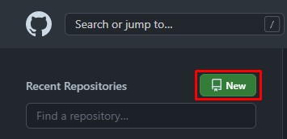
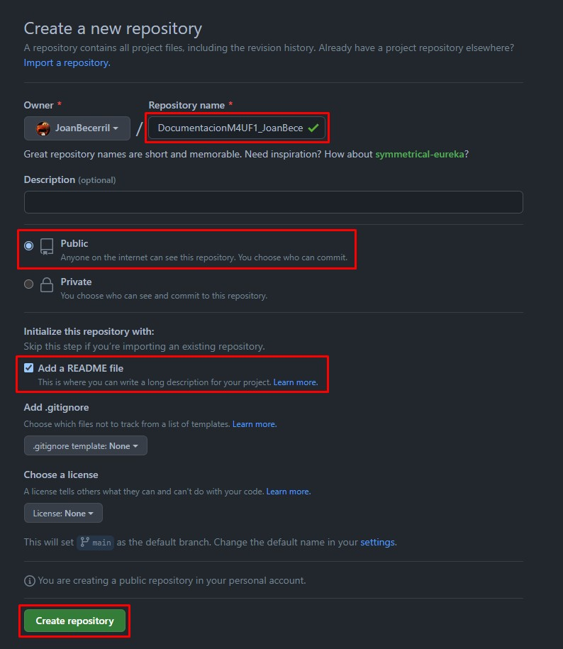
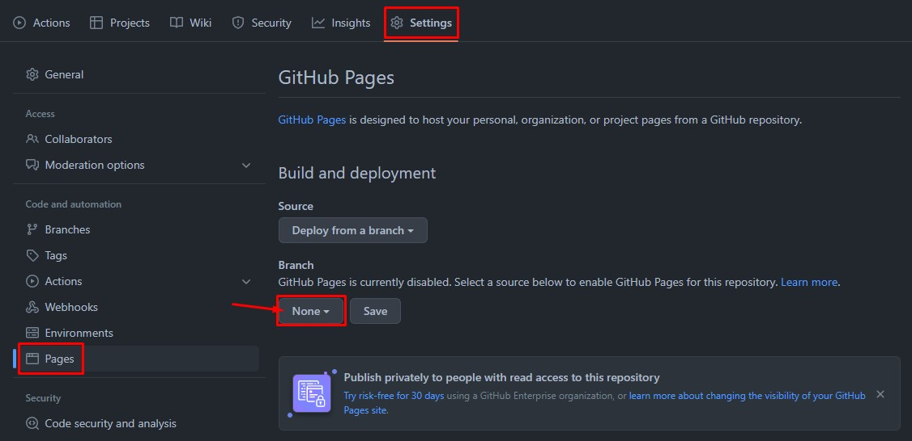
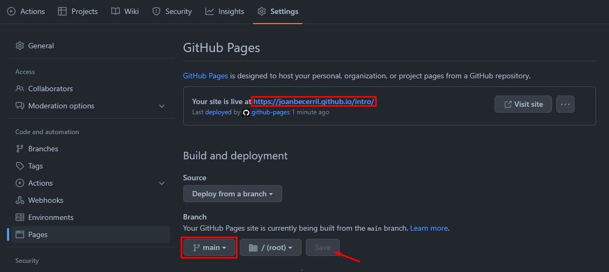
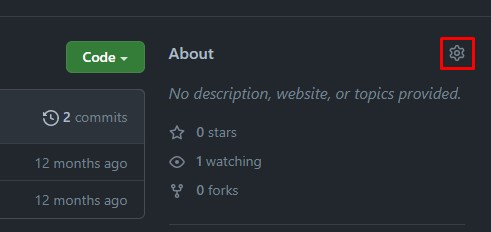
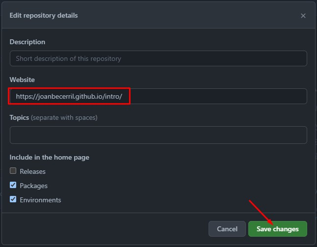
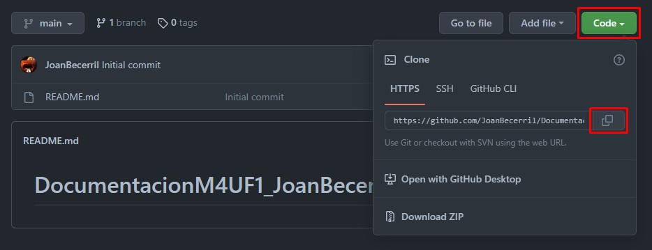
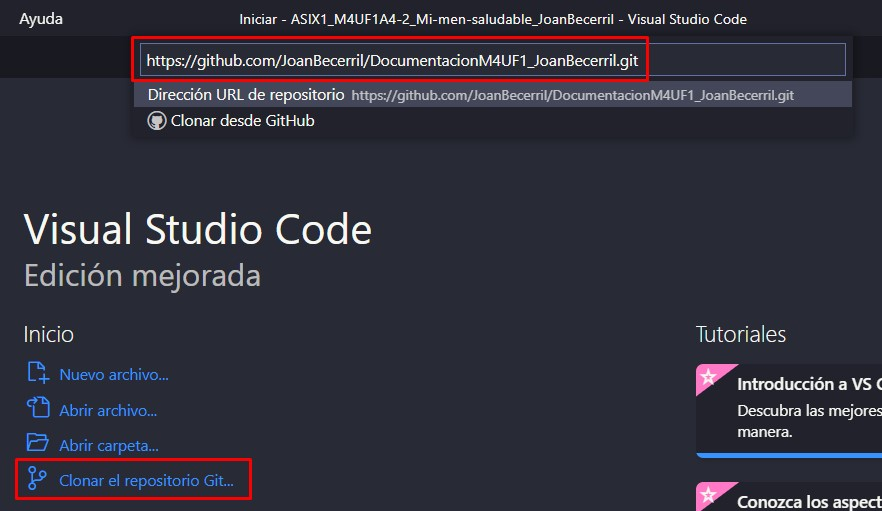
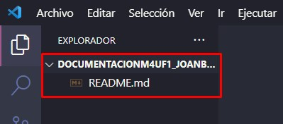

# DocumentacionM4UF1_JoanBecerril

# Github
### Crear Respositorio
##### Para crear un repositorio clicamos el siguiente botón:

##### Seleccionamos los ajustes como el nombre, el estado, privado o publico, si queremos archivo README y de más. Una vez acabemos creamos el repositorio con el boton verde.

##### El repositorio ya estaria listo para usarse.

### Github Pages
##### Para conseguir el link de nuestra pagina web debemos ir a ajustes, en el apartado de 'Pages' veremos un seleccionador con 'None', ahí debemos cambiarlo por 'main'.

##### Una vez cambiado por 'main' guardaremos los cambios y nos aparecerá un link arriba. Este es el link de nuestra web de github.

##### Para acabar vamos al principio de la pagina en github y vamos a este botón.

##### Con el link copiado lo pegamos en ese recuadro y guardamos. Esto es para que el link aparezca en la pagina principal y sea mas intuitivo.


### Clonar Repositorio en VisualStudio
##### Para clonar el repositorio debemos copiar el codigo HTTPS como se muetra en la imagen.

##### Abrimos VisualStudioCode y clicamos el boton de 'Clonar el repositorio Git' despues pegamos lo copiado anteriormente.

##### Como vemos ya estaria clonado en local y podriamos trabajar comodamente.


### Subir Cambios a Github
#####

# Markdown
### Encabezados
Se utilizan de titulo, en los cuales hay diferentes tamaños:
```
#                                   Encabezado 1 [H1]
##                                  Encabezado 2 [H2]
###                                 Encabezado 3 [H3]
####                                Encabezado 4 [H4]
#####                               Encabezado 5 [H5]
######                              Encabezado 6 [H6]
```
#                                   Encabezado 1 [H1]
##                                  Encabezado 2 [H2]
###                                 Encabezado 3 [H3]
####                                Encabezado 4 [H4]
#####                               Encabezado 5 [H5]
######                              Encabezado 6 [H6]

### Estilos de letra
Para definir un estilo a un texto tenemos todos estos tipos:
```
***Estilo***                        Negrita y Cursiva
**Estilo**                          Negrita
*Estilo*                            Cursiva
**Estilo_Estilo_Estilo**            Negrita Cursiva Negrita
>Estilo                             Anotacion
~~Estilo~~                          Tachar
```
***Estilo***                        Negrita y Cursiva
**Estilo**                          Negrita
*Estilo*                            Cursiva
**Estilo_Estilo_Estilo**            Negrita Cursiva Negrita
>Estilo                             Anotacion
~~Estilo~~                          Tachar

### Codigo
El codigo se expresa con 3 comas y se interpreta asi:
```
<html>
  <div
  </div>
</html>
```
<html>
  <div
  </div>
</html>

### Listas
#### Desordenadas
```
- lista                             Elemento de lista
- lista                             Elemento de lista
  - lista                           Elemento de lista con 1 TAB
  - lista                           Elemento de lista con 1 TAB
    - lista                         Elemento de lista con 2 TAB
    - lista                         Elemento de lista con 2 TAB
```
- lista                             Elemento de lista
- lista                             Elemento de lista
  - lista                           Elemento de lista con 1 TAB
  - lista                           Elemento de lista con 1 TAB
    - lista                         Elemento de lista con 2 TAB
    - lista                         Elemento de lista con 2 TAB
#### Ordenadas
```
1. lista                            Elemento de lista 1
2. lista                            Elemento de lista 2
3. lista                            Elemento de lista 3
4. lista                            Elemento de lista 4
  1. lista                          Elemento de lista 5 con TAB
  2. lista                          Elemento de lista 6 con TAB
```
1. lista                            Elemento de lista 1
2. lista                            Elemento de lista 2
3. lista                            Elemento de lista 3
4. lista                            Elemento de lista 4
  1. lista                          Elemento de lista 5 con TAB
  2. lista                          Elemento de lista 6 con TAB

### LINKS
```
<https://drive.google.com/>
```
<https://drive.google.com/>

## IMAGENES
```

```


# HTML

###
